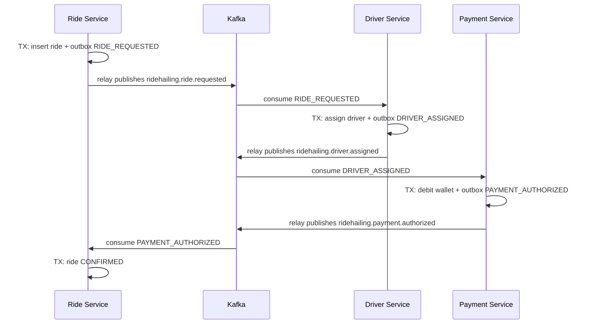

# Ride Hailing — Transactional Messaging & Saga (Demo)

Reference implementation for **thesis / technical presentation**: **Transactional Outbox** (transactional messaging), **Saga (choreography)**, and **idempotent consumers** in a Spring Boot 3 + PostgreSQL + Kafka multi-module project.

**Kịch bản test thủ công (tiếng Việt, từng bước):** [`docs/KICH_BAN_TEST.md`](docs/KICH_BAN_TEST.md)

---

## 1. The problem: dual write

Updating **two systems** in one business action (e.g. commit DB **and** send to Kafka) without a distributed transaction causes **inconsistency** if one step succeeds and the other fails. There is **no atomicity** across DB and broker.

**Anti-patterns (only hide the issue):** “send Kafka first then DB”, blind retries without durable intent, wrapping unrelated systems in a single DB transaction that also touches Kafka (Kafka is not part of that transaction).

---

## 2. Solution A — Transactional outbox (same database transaction)

**Idea:** In **one local ACID transaction**, persist:

1. Business data (ride / driver / wallet row).
2. A row in an **outbox** table (payload = event envelope JSON).

**Then** a **relay** publishes outbox rows to Kafka. This repo demonstrates **two** relay styles (see **`docs/SOA_SII_2025_2026.md`** for diagrams & course notes `SOA_SII_2025_2026`):

| Relay | Role in this repo |
|-------|-------------------|
| **Polling publisher** | `@Scheduled` `*OutboxRelayService` reads `published_at IS NULL`, sends to **business** topics (`ridehailing.*`), marks published. Toggle: `app.outbox.polling-relay-enabled` (default `true`). |
| **CDC (log tailing)** | **Debezium** reads PostgreSQL **WAL** → Kafka topics `ridehailing.cdc.<schema>.outbox_messages` (same physical rows; **different** topic namespace — avoids duplicate delivery to saga consumers while you demo WAL). |

If the process crashes after Kafka ack but before mark, Kafka may see a **duplicate** — consumers must be **idempotent** (§4).

**Files (per service):**

| Concern | Location |
|--------|-----------|
| Write aggregate + outbox in one `@Transactional` method | `application/service/*ApplicationService`, `*OutboxAdapter` |
| Polling relay → Kafka | `infrastructure/messaging/*OutboxRelayService` (`@ConditionalOnProperty`) |
| Mark published (polling path) | `infrastructure/messaging/*OutboxMarker` |
| CDC | `compose.yaml` (Debezium), `debezium/postgres-outbox-connector.json`, `scripts/register-debezium-connector.sh` |

---

## 3. Solution B — Saga (choreography, no 2PC)

Long-running business flows across **multiple services** with **separate databases** cannot use one global ACID transaction. **Saga** = sequence of **local transactions**, each publishing **events**; the next service reacts. **No two-phase commit.**

This demo uses **choreography**: there is **no central orchestrator**. Each service subscribes to topics and runs its step.

**Compensation:** If payment fails after a driver was assigned, **Ride** service moves state to cancelled and enqueues **`RELEASE_DRIVER`** via **outbox** so **Driver** service frees the driver (compensating action).

**Saga steps (happy path):**



**Failure / compensation (example):**

- Driver assigns → Payment fails → **Payment** publishes `PAYMENT_FAILED` → **Ride** cancels and writes **`RELEASE_DRIVER`** to outbox → **Driver** consumes and sets driver `AVAILABLE` again.

---

## 4. Idempotency (at-least-once Kafka)

Kafka is configured for **at-least-once** delivery. The same message may be processed twice. Each consumer stores **`eventId`** (from `EventEnvelope`) in **`processed_inbound_events`** before finishing the business transaction. Duplicates are **skipped**.

---

## 5. Module layout (Clean Architecture)

Each service follows the same idea:

| Layer | Responsibility |
|-------|----------------|
| **domain** | Enums, domain exceptions, error codes (ride only exposes rich HTTP errors). |
| **application** | **Ports** (in/out), **use cases** / saga application services, **commands/results** (no Spring Web types). |
| **infrastructure** | JPA entities, repositories, Kafka listeners, outbox relay, MapStruct mappers to map entities ↔ application models. |
| **adapter.web** (ride only) | REST DTOs, validation, `RestExceptionHandler` (RFC 7807–style error body). |

**shared-kernel:** shared **Kafka topic names**, **event type strings**, **payload records**, **`EventEnvelope`**.

**Database:** one PostgreSQL database `ride_db`, **three schemas** (`ride`, `driver`, `payment`). Each service ships `src/main/resources/schema.sql` (`CREATE SCHEMA IF NOT EXISTS …`) and `spring.sql.init.mode=always` + `spring.jpa.defer-datasource-initialization=true` so **schemas are created on startup** (no manual SQL on TA unless the DB user lacks `CREATE`). Docker `init-db.sql` is optional redundancy for local compose.

---

## 6. Ports & services (quick map)

| Service | Port (HTTP) | Main application services |
|---------|-------------|---------------------------|
| **ride-service** | 8081 | `RideBookingApplicationService`, `RideStateApplicationService` |
| **driver-service** | 8082 (actuator/web only if needed) | `DriverApplicationService` |
| **payment-service** | 8083 | `PaymentApplicationService` |

Kafka consumer **group ids**: `ride-saga`, `driver-saga`, `payment-saga`.

---

## 7. Run the stack

### 7.1 Infrastructure

```bash
docker compose up -d postgres kafka zookeeper kafka-ui debezium
```

Postgres uses `wal_level=logical` for CDC. First-time init: `init-db.sql` creates schemas + `REPLICATION` on `ride_user`. If an **old** volume existed without these, run `docker compose down -v` then `up` again.

**Debezium (CDC demo):** after containers are healthy:

```bash
bash scripts/register-debezium-connector.sh
```

Open Kafka UI (`http://localhost:8080`) and inspect topics `ridehailing.cdc.ride.outbox_messages`, etc. Full narrative: **`docs/SOA_SII_2025_2026.md`**.

### 7.2 Build

```bash
./mvnw clean install -DskipTests
```

### 7.3 Start services (3 terminals)

```bash
./mvnw -pl ride-service spring-boot:run
./mvnw -pl driver-service spring-boot:run
./mvnw -pl payment-service spring-boot:run
```

Environment defaults assume **Postgres** `localhost:5432`, **Kafka** `localhost:9092` (see each `application.yaml`).

---

## 8. Demo API (ride-service)

**Happy path** — passenger `p1` has balance `500000` in seed data:

```bash
curl -s -X POST http://localhost:8081/api/v1/rides/book \
  -H "Content-Type: application/json" \
  -H "Idempotency-Key: thesis-demo-1" \
  -d '{"passengerId":"p1","pickupLocation":"A","dropOffLocation":"B","estimatedAmount":50000}'
```

Poll status:

```bash
curl -s http://localhost:8081/api/v1/rides/<rideId-from-response>
```

**Payment failure + compensation** — use passenger `poor` (balance `100`) with a large `estimatedAmount` → expect `CANCELLED_PAYMENT` and driver release via `ridehailing.driver.release`.

**Idempotent replay:** same `Idempotency-Key` + same body returns the same ride (HTTP 201 with same resource semantics as first create).

---

## 9. Kafka UI

Open **http://localhost:8080** — inspect topics under prefix `ridehailing.*`.

---

## 10. Thesis / presentation checklist

Use **`docs/SOA_SII_2025_2026.md`** (bilingual notes + Mermaid) and this outline:

1. **Dual write** — naive “DB then Kafka” failure (diagram in SOA doc).
2. **Transactional outbox** — one TX for data + `outbox_messages`; data-flow diagram.
3. **Relay comparison** — **polling publisher** vs **log tailing (CDC)**; when to use which.
4. **Debezium** — WAL → Kafka (live: CDC topics in Kafka UI).
5. **At-least-once** + **idempotent consumer** (`eventId` + `processed_inbound_events`).
6. **Saga choreography** + compensation (`RELEASE_DRIVER`).

---

## 11. Repository structure

```
ride-hailing/
├── shared-kernel/          # EventEnvelope, payloads, KafkaTopics, EventTypes
├── ride-service/
├── driver-service/
├── payment-service/
├── debezium/               # Postgres connector JSON (CDC)
├── scripts/                # register-debezium-connector.sh
├── docs/
│   ├── SOA_SII_2025_2026.md   # Course / defense: dual write, outbox, polling vs CDC, idempotency
│   └── KICH_BAN_TEST.md        # Manual test script (VN), ordered steps + curl
├── init-db.sql
├── compose.yaml            # Postgres (logical WAL), Kafka, Kafka UI, Debezium
└── README.md
```

---

## License / academic use

Free to use for coursework, thesis defense slides, and demos. Production systems would add: security, observability (tracing), stricter schema governance, and possibly CDC-based outbox relay.
