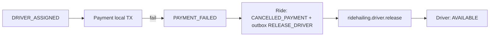
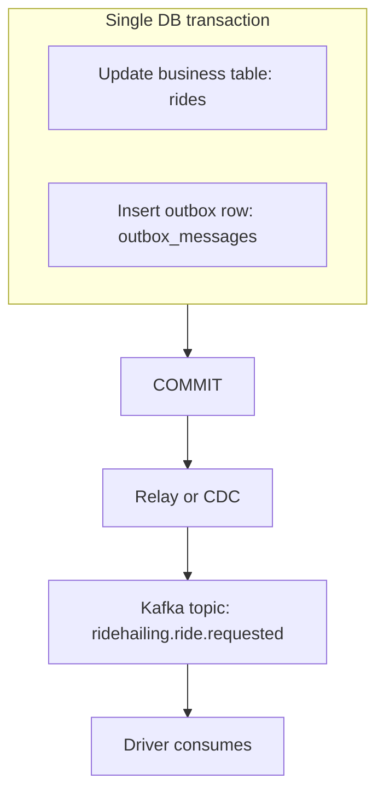
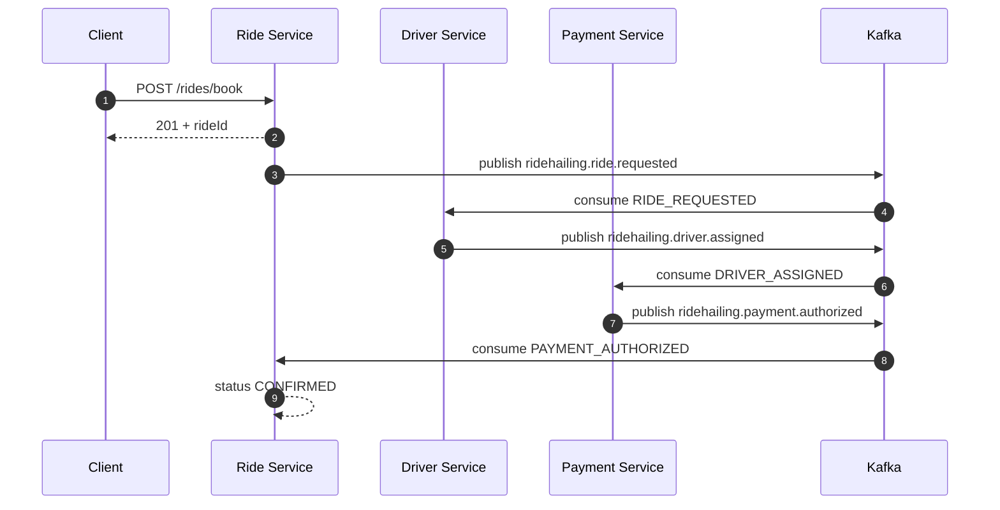
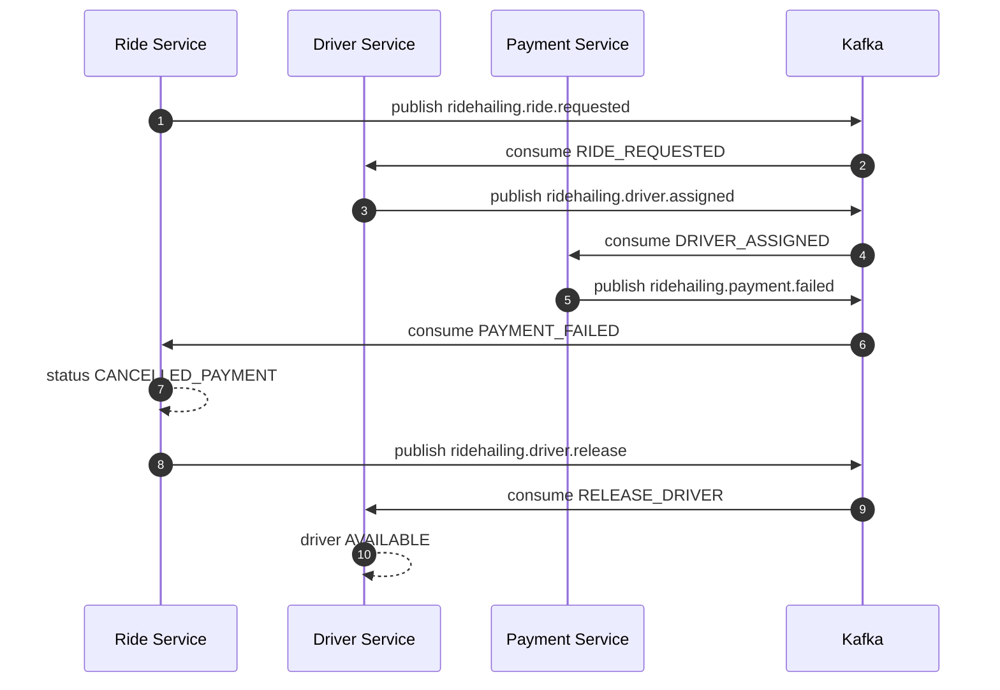

# Kịch bản demo SOA_SII_2025_2026 (từ đầu đến cuối, tuần tự)

Mục tiêu của tài liệu: bạn chạy demo **đúng thứ tự**, vừa giải thích “naive dual write” và “Transactional Outbox”, vừa show **Polling publisher vs CDC (Debezium)**, **Saga (choreography + compensation)** như mục **0.1** và **8**, và cuối cùng show **idempotency** chống at-least-once.

Tài liệu dùng cho local hoặc môi trường TA. Nếu khác host/port, chỉ cần đổi biến `DB_URL`, `KAFKA_SERVERS` và các URL trong lệnh `curl`.

--- 

## 0. Thông số cần biết trước

1. Service:
   - `ride-service`: `http://localhost:8081`
   - `driver-service`: `8082`
   - `payment-service`: `8083`
2. Kafka UI: `http://localhost:8080`
3. Topics saga (business topics do polling relay publish):
   - `ridehailing.ride.requested`
   - `ridehailing.driver.assigned`
   - `ridehailing.driver.not_found`
   - `ridehailing.payment.authorized`
   - `ridehailing.payment.failed`
   - `ridehailing.driver.release`
4. Topics CDC (Debezium log tailing, quan sát nhưng không dùng để chạy saga trong code hiện tại):
   - `ridehailing.cdc.ride.outbox_messages`
   - `ridehailing.cdc.driver.outbox_messages`
   - `ridehailing.cdc.payment.outbox_messages`

### 0.1 Kịch bản test Saga pattern (theo flow choreography, không 2PC)

**Bối cảnh (có thể trích cho slide / báo cáo):**

- Luồng nghiệp vụ kéo dài qua **nhiều service**, mỗi service một **database riêng** — không thể gói trong **một giao dịch ACID toàn cục**.
- **Saga** = chuỗi **giao dịch cục bộ** (local transaction), mỗi bước **publish event**; service kế tiếp **phản ứng** qua message. **Không two-phase commit (2PC).**
- Demo này dùng **choreography**: **không có orchestrator trung tâm**. Mỗi service **subscribe topic** và thực hiện bước của mình.
- **Transactional outbox:** intent gửi Kafka được ghi **cùng TX** với dữ liệu nghiệp vụ; relay đẩy lên Kafka (xem mục 4–6).

**Happy path (tóm tắt):** Ride ghi `RIDE_REQUESTED` → Driver gán xe, publish `DRIVER_ASSIGNED` → Payment trừ ví, publish `PAYMENT_AUTHORIZED` → Ride chuyển `CONFIRMED`.

**Compensation (kịch bản test bắt buộc để “chứng minh” saga):**

1. Driver đã gán (`DRIVER_ASSIGNED` đã đi qua Kafka).
2. Payment thất bại (ví không đủ) → trong DB payment, publish event **`PAYMENT_FAILED`** (topic `ridehailing.payment.failed`).
3. **Ride** consume `PAYMENT_FAILED`: đổi trạng thái ride sang hủy do thanh toán (**`CANCELLED_PAYMENT`**) và trong **cùng logic outbox**, enqueue **`RELEASE_DRIVER`** để bù trừ.
4. Relay đẩy `RELEASE_DRIVER` lên topic **`ridehailing.driver.release`**.
5. **Driver** consume `RELEASE_DRIVER` → đặt lại tài xế **AVAILABLE** (hành động bù — compensating action).

Chuỗi có thể vẽ nhanh:



**Cách verify trong demo:** bước `curl` + Kafka UI cụ thể nằm ở **mục 8** (8.1 happy path, 8.2 compensation). Event type trong code: `EventTypes.PAYMENT_FAILED`, `RELEASE_DRIVER`; topic release: `KafkaTopics.DRIVER_RELEASE` (`ridehailing.driver.release`).

--- 

## 1. Chuẩn bị hạ tầng (bắt buộc)

1. Mở terminal ở thư mục gốc repository (clone `saga-pattern` của bạn)
2. Chạy stack:
   ```bash
   docker compose up -d postgres kafka zookeeper kafka-ui debezium
   ```
3. Đợi 1–2 phút để Kafka + Debezium Connect sẵn sàng.
4. Mở Kafka UI: `http://localhost:8080` (vào được là ok).

Nếu DB cũ đã chạy trước khi bạn bật WAL/REPLICATION, dùng:
```bash
docker compose down -v
docker compose up -d postgres kafka zookeeper kafka-ui debezium
```

--- 

## 2. Build và khởi động microservices

1. Build:
   ```bash
   ./mvnw clean install -DskipTests
   ```
2. Khởi động 3 service theo thứ tự để consumer sẵn sàng trước khi bạn gọi API:

Terminal 1 (driver 8082):
```bash
./mvnw -pl driver-service spring-boot:run
```

Terminal 2 (payment 8083):
```bash
./mvnw -pl payment-service spring-boot:run
```

Terminal 3 (ride 8081):
```bash
./mvnw -pl ride-service spring-boot:run
```

3. Chờ đến khi log không còn lỗi DB/schema và ride API trả HTTP được.

--- 

## 3. Dual Write lỗi (naive approach) — chỉ ra “DB OK nhưng message fail ⇒ inconsistent”

### 3.1 Ý tưởng để nói với hội đồng

Trong naive dual write, luồng nghiệp vụ sẽ kiểu:
1. `BEGIN TX` → ghi dữ liệu vào DB.
2. `COMMIT` DB thành công.
3. Gửi message sang Kafka (nhưng Kafka down / send lỗi).

Kết quả: DB có dữ liệu nhưng event mất → service phụ thuộc event không biết giao dịch đã xảy ra → hệ thống lệch.

Trong demo, ta mô phỏng “event mất” bằng cách tạo **row trong DB nhưng không tạo outbox row**, tức là không có durable intent.

### 3.2 Thực hiện mô phỏng (DB có ride nhưng saga không chạy)

1. Chờ 10 giây để mọi bảng đã được Hibernate tạo trong schema.
2. Chèn 1 ride trực tiếp vào DB (không outbox):

Chạy lệnh sau (thay `RIDE_ID` tự động tạo theo SQL):
```bash
docker exec -i ride_postgres psql -U ride_user -d ride_db -c "
DO \$\$
DECLARE rid uuid := gen_random_uuid();
BEGIN
  INSERT INTO ride.rides(
    id, passenger_id, pickup_location, drop_off_location,
    estimated_amount, status, idempotency_key, driver_id, created_at, updated_at
  ) VALUES (
    rid, 'p1', 'N1', 'N2',
    50000, 'REQUESTED', 'naive-dualwrite-1', NULL, now(), now()
  );
  RAISE NOTICE 'NAIVE RIDE_ID=%', rid;
END \$\$;"
```

3. Sao chép `NAIVE RIDE_ID` trong output NOTICE.
4. Xác nhận ride nằm ở trạng thái `REQUESTED`:
```bash
docker exec -i ride_postgres psql -U ride_user -d ride_db -c "
SELECT id, status, driver_id FROM ride.rides WHERE id = '<NAIVE_RIDE_ID>';"
```
5. Chờ 5–10 giây.
6. Xác nhận vẫn không có driver assignment:
```bash
curl -s http://localhost:8081/api/v1/rides/<NAIVE_RIDE_ID>
```

Kỳ vọng:
- `status` vẫn là `REQUESTED`
- `driverId` = `null`

Giải thích:
- Vì không có message `ridehailing.ride.requested` (không có outbox row để relay/CDC phát), driver/payment không bao giờ bắt đầu saga.

--- 

## 4. Giải pháp: Transactional Outbox Pattern — đúng logic “data + message intent trong 1 TX”

### 4.1 Data flow diagram (đọc kèm lúc demo)

Bạn có thể nói theo hình:


### 4.2 Thực hiện outbox theo đúng happy path (để thấy hệ thống nhất quán)

1. Gọi book ride (p1 đủ tiền):
```bash
curl -s -X POST http://localhost:8081/api/v1/rides/book \
  -H "Content-Type: application/json" \
  -H "Idempotency-Key: outbox-happy-$(date +%s)" \
  -d '{"passengerId":"p1","pickupLocation":"Q1","dropOffLocation":"Q2","estimatedAmount":50000}'
```

2. Ghi lại `data.id` là `RIDE_ID_OUTBOX`.
3. Chờ 5–15 giây.
4. Kiểm tra trạng thái:
```bash
curl -s http://localhost:8081/api/v1/rides/<RIDE_ID_OUTBOX>
```

Kỳ vọng:
- `status = CONFIRMED`
- `driverId != null`

--- 

## 5. So sánh 2 kỹ thuật message relay: Polling Publisher vs Log Tailing (CDC)

### 5.1 Polling publisher (trạng thái saga chạy)

Đảm bảo đang chạy mặc định `app.outbox.polling-relay-enabled=true` (tham số có trong `application.yaml`).

Thực hiện:
1. Gọi thêm 1 ride khác (p1, money đủ).
2. Quan sát Kafka UI:
   - Có message trên các topic business `ridehailing.ride.requested`, tiếp đó là `ridehailing.driver.assigned`, `ridehailing.payment.authorized`.
3. Quan sát API:
   - ride chuyển sang `CONFIRMED`.

### 5.2 CDC (Debezium log tailing) — cùng outbox row nhưng đi qua CDC topics

Bây giờ bạn làm test “polling tắt để chỉ CDC hoạt động”.

1. Dừng 3 service bằng Ctrl+C.
2. Khởi động lại 3 service với polling relay tắt:

Terminal 1:
```bash
./mvnw -pl driver-service spring-boot:run -Dspring-boot.run.arguments="--app.outbox.polling-relay-enabled=false"
```
Terminal 2:
```bash
./mvnw -pl payment-service spring-boot:run -Dspring-boot.run.arguments="--app.outbox.polling-relay-enabled=false"
```
Terminal 3:
```bash
./mvnw -pl ride-service spring-boot:run -Dspring-boot.run.arguments="--app.outbox.polling-relay-enabled=false"
```

3. Gọi book ride mới (p1):
```bash
curl -s -X POST http://localhost:8081/api/v1/rides/book \
  -H "Content-Type: application/json" \
  -H "Idempotency-Key: cdc-only-$(date +%s)" \
  -d '{"passengerId":"p1","pickupLocation":"C1","dropOffLocation":"C2","estimatedAmount":50000}'
```

4. Ghi `data.id` → `RIDE_ID_CDC`.
5. Chờ 5–20 giây.

Quan sát:
1. API ride-service:
   - `status` vẫn là `REQUESTED` (vì business topics do polling relay không còn được publish)
2. Kafka UI:
   - Bạn vẫn thấy message ở CDC topics dạng `ridehailing.cdc.<schema>.outbox_messages` (Debezium đã bắt được INSERT vào `outbox_messages`).

Giải thích để chốt:
- Polling publisher là cách “đọc DB bảng outbox”.
- CDC/log tailing là cách “đọc WAL của Postgres”, tạo Kafka messages ngay khi outbox row thay đổi.

--- 

## 6. Show Debezium đọc WAL và đẩy sang Kafka (cách nói chuẩn)

### 6.1 Đăng ký connector (làm 1 lần đầu)

Chạy:
```bash
bash scripts/register-debezium-connector.sh
```

Nếu báo lỗi “connector exists”, xóa trước:
```bash
curl -X DELETE http://localhost:8084/connectors/postgres-outbox-cdc
bash scripts/register-debezium-connector.sh
```

### 6.2 Demo theo timeline

1. Trong Kafka UI, mở topic prefix `ridehailing.cdc`.
2. Gọi một request `POST /rides/book`.
3. Quan sát sau vài giây xuất hiện event trong:
   - `ridehailing.cdc.ride.outbox_messages`
4. (Tuỳ) khi driver/payment tạo outbox ở schema tương ứng, bạn sẽ thấy thêm:
   - `ridehailing.cdc.driver.outbox_messages`
   - `ridehailing.cdc.payment.outbox_messages`

--- 

## 7. Idempotency (at-least-once) — chứng minh consumer xử lý trùng lặp

### 7.1 Ý tưởng để nói

Kafka delivery thường là **at-least-once** ⇒ cùng 1 event có thể được consume lại.

Giải pháp trong code này:
- Mỗi message value là `EventEnvelope` có `eventId`.
- Consumer thực hiện (trong transaction):
  - nếu `eventId` đã có trong bảng `processed_inbound_events` ⇒ bỏ qua (skip)
  - nếu chưa có ⇒ xử lý + insert `eventId` vào `processed_inbound_events`

### 7.2 Cách tạo duplicate “đúng chuẩn” trong demo

1. Bật lại polling relay để saga chạy hoàn chỉnh:
   - dừng 3 service
   - chạy lại 3 service bình thường (không truyền `--app.outbox.polling-relay-enabled=false`)
2. Thực hiện happy path để tạo đủ một chuỗi message:
   - Book ride với `p1`:
```bash
curl -s -X POST http://localhost:8081/api/v1/rides/book \
  -H "Content-Type: application/json" \
  -H "Idempotency-Key: idem-dupe-$(date +%s)" \
  -d '{"passengerId":"p1","pickupLocation":"A2","dropOffLocation":"B2","estimatedAmount":50000}'
```
3. Sau 5–15 giây, mở Kafka UI:
   - vào topic `ridehailing.driver.assigned`
   - chọn 1 message mà bạn thấy vừa publish
   - copy nguyên “Value” (JSON message envelope).
4. Trở lại màn hình Produce message của Kafka UI:
   - dán y nguyên “Value” message đó và publish thêm lần 2 (giả lập duplicate).
5. Kiểm tra idempotency bằng DB count:
```bash
docker exec -i ride_postgres psql -U ride_user -d ride_db -c "
SELECT count(*) FROM driver.processed_inbound_events;"
```
6. Đợi 5 giây, chạy lại câu query count.

Kỳ vọng:
- Count không tăng thêm (eventId đã tồn tại ⇒ skip).

Giải thích chốt:
- Dù broker đưa message lại, consumer vẫn nhất quán nhờ dedupe theo `eventId`.

--- 

## 8. Saga choreography chi tiết (bắt buộc để demo) — step + compensation

> Tóm tắt lý thuyết và ý nghĩa “không 2PC / choreography” đã nêu ở **mục 0.1**. Dưới đây là **bước chạy tay** (curl + Kafka UI).

Phần này bạn dùng để “nói” rõ saga quan trọng như thế nào: nhiều transaction nhỏ nối nhau bằng event, và khi fail thì có **compensation**.

### 8.1 Saga happy path (REQUESTED → AWAITING_PAYMENT → CONFIRMED)

Kịch bản: gọi đặt xe cho `p1`, sau đó theo dõi trạng thái theo thời gian.

1. Tạo ride (happy path):
   ```bash
   curl -s -X POST http://localhost:8081/api/v1/rides/book \
     -H "Content-Type: application/json" \
     -H "Idempotency-Key: saga-happy-$(date +%s)" \
     -d '{"passengerId":"p1","pickupLocation":"S1","dropOffLocation":"S2","estimatedAmount":50000}'
   ```
2. Ghi lại `rideId` trong `data.id`.
3. Ngay sau khi nhận response (0–1 giây): kiểm tra:
   ```bash
   curl -s http://localhost:8081/api/v1/rides/<rideId>
   ```
   Kỳ vọng: `status = REQUESTED` (hoặc tương ứng trạng thái initial của ride).
4. Sau 5–10 giây: kiểm tra lại:
   ```bash
   curl -s http://localhost:8081/api/v1/rides/<rideId>
   ```
   Kỳ vọng: `status = AWAITING_PAYMENT` (đã nhận `DRIVER_ASSIGNED`).
5. Sau thêm 5–15 giây:
   ```bash
   curl -s http://localhost:8081/api/v1/rides/<rideId>
   ```
   Kỳ vọng: `status = CONFIRMED` (đã nhận `PAYMENT_AUTHORIZED`).

Diễn giải bằng sequence (dùng để bạn nói thuyết trình):



### 8.2 Saga compensation (khi payment fail → CANCELLED_PAYMENT + RELEASE_DRIVER)

1. Tạo ride với `poor` và amount lớn (đảm bảo thiếu tiền):
   ```bash
   curl -s -X POST http://localhost:8081/api/v1/rides/book \
     -H "Content-Type: application/json" \
     -H "Idempotency-Key: saga-comp-$(date +%s)" \
     -d '{"passengerId":"poor","pickupLocation":"C1","dropOffLocation":"C2","estimatedAmount":99999}'
   ```
2. Ghi `rideId` từ `data.id`.
3. Sau 5–15 giây, kiểm tra trạng thái:
   ```bash
   curl -s http://localhost:8081/api/v1/rides/<rideId>
   ```
4. Kỳ vọng: `status = CANCELLED_PAYMENT`.
5. Trên Kafka UI, xác nhận xuất hiện event bù trừ:
   - Topic: `ridehailing.driver.release`
   - (event này được Ride Service enqueue vào outbox khi xử lý `PAYMENT_FAILED`)

Sequence cho compensation:



--- 

## 10. (tuỳ chọn) B3 compensation để demo saga bù trừ

1. Book ride với `poor` và amount lớn:
```bash
curl -s -X POST http://localhost:8081/api/v1/rides/book \
  -H "Content-Type: application/json" \
  -H "Idempotency-Key: comp-$(date +%s)" \
  -d '{"passengerId":"poor","pickupLocation":"X","dropOffLocation":"Y","estimatedAmount":99999}'
```
2. Đợi 5–15 giây.
3. Check:
```bash
curl -s http://localhost:8081/api/v1/rides/<RIDE_ID>
```
Kỳ vọng: `CANCELLED_PAYMENT`.

--- 

## 11. Checklist “đúng ý SOA_SII_2025_2026”

1. Dual write naive: DB ride có nhưng không có event ⇒ ride đứng `REQUESTED`.
2. Outbox pattern: cùng request → ride `CONFIRMED`.
3. Polling publisher vs CDC:
   - polling bật ⇒ business topics xuất hiện ⇒ saga chạy
   - polling tắt ⇒ business topics không xuất hiện ⇒ saga không chạy, nhưng CDC topics vẫn xuất hiện
4. Debezium: đăng ký connector + quan sát CDC topics.
5. Idempotency: publish duplicate JSON ⇒ bảng `processed_inbound_events` không tăng.
6. Saga choreography + compensation: `PAYMENT_FAILED` → ride `CANCELLED_PAYMENT` + outbox `RELEASE_DRIVER` → topic `ridehailing.driver.release` → tài xế `AVAILABLE` (mục **0.1** + **8.2**).

Nếu bạn muốn, mình có thể tạo thêm 1 file “kịch bản lời dẫn” (script nói miệng) để bạn thuyết trình trơn tru từng đoạn theo timeline 5–7 phút.
