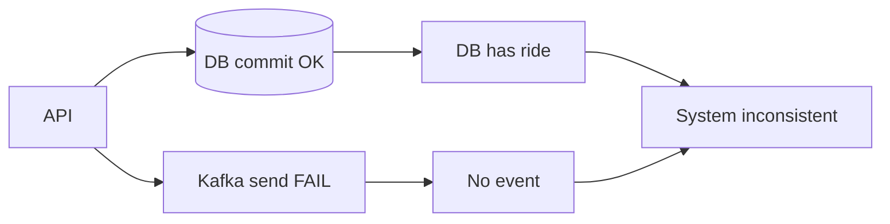
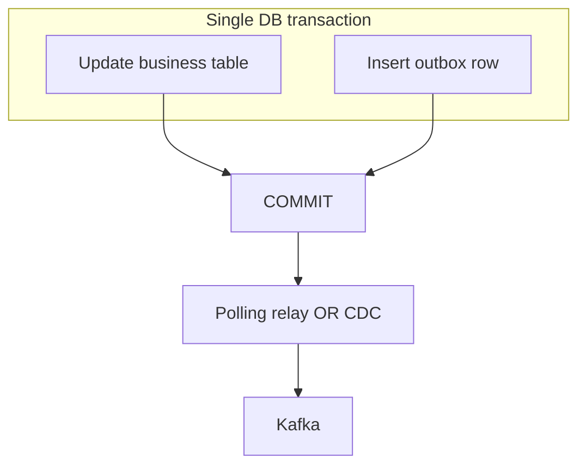
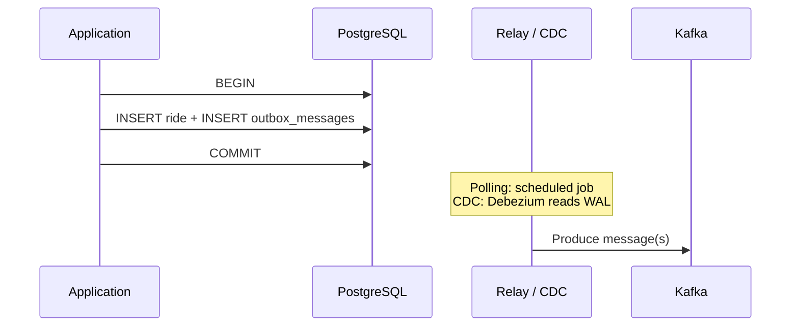
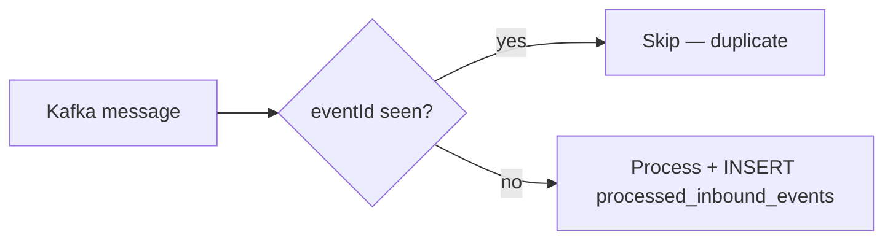

# SOA / Integration — Transactional Messaging & Saga (Course notes)

**Context:** `SOA_SII_2025_2026` — demo repo: `ride-hailing` (Spring Boot, PostgreSQL, Kafka, optional Debezium).

---

## 1. Dual write (the naive approach)

**Problem:** One business operation updates **two systems** (e.g. PostgreSQL + Kafka) **without** a single atomic boundary.

Example: commit the ride row **successfully**, then call `kafkaTemplate.send(...)`. If the broker fails, the database already shows the ride as created but **no event** was published → downstream services never see the booking → **inconsistent state**.



This is often called **the naive approach**: “write DB, then fire-and-forget message.” It is **not** atomic across DB and broker.

---

## 2. Transactional Outbox Pattern

**Idea:** Do **not** send to Kafka inside the same “hope” as the DB write. Instead, in **one database transaction**:

1. Persist domain data (e.g. `rides` row).
2. Persist an **outbox** row (`outbox_messages`: payload JSON, event type, aggregate id, …).

Either **both** commit or **both** roll back → **no lost intent** inside the DB.

**Relay** (separate concern) publishes from the outbox table to Kafka:

| Technique | How it works |
|-----------|----------------|
| **Polling publisher** | Scheduler / worker `SELECT … WHERE published_at IS NULL`, `send` to Kafka, then mark published (this repo: `*OutboxRelayService`). |
| **Log tailing (CDC)** | Read PostgreSQL **WAL** (logical replication) via **Debezium** → Kafka **change events** on `outbox_messages` (topics like `ridehailing.cdc.<schema>.outbox_messages`). |



**Data flow (conceptual):**



---

## 3. Polling publisher vs log tailing (CDC)

| | **Polling publisher** | **Log tailing (CDC / Debezium)** |
|---|------------------------|----------------------------------|
| **Mechanism** | App or job queries `outbox` table periodically. | Connector reads **replication stream** (Postgres logical decoding). |
| **Coupling** | Simple; needs DB access from the publisher service. | Needs `wal_level=logical`, replication slot, Connect cluster. |
| **Latency** | Bounded by poll interval (e.g. 500 ms). | Lower latency; near real-time from WAL. |
| **Load** | Extra `SELECT` on outbox; must mark processed rows. | WAL I/O; Kafka Connect overhead. |
| **Duplicates** | Possible if mark-after-send fails → **at-least-once** to Kafka. | Same: retries / crashes → **at-least-once**. |
| **Demo in repo** | `@Scheduled` `*OutboxRelayService`, toggle `app.outbox.polling-relay-enabled`. | Docker `debezium` + `scripts/register-debezium-connector.sh`. |

**Important:** Do **not** publish the **same** business event **twice** to the **same** consumer topic from **both** polling and CDC without a routing/dedup strategy. For this project:

- **Default:** polling → topics `ridehailing.ride.requested`, … (saga consumers).
- **CDC:** separate topic prefix `ridehailing.cdc.*` for **observability / thesis demo** (WAL → Kafka proof).

---

## 4. Debezium: WAL → Kafka

1. PostgreSQL: `wal_level=logical` (see `compose.yaml`).
2. User: `REPLICATION` privilege (`init-db.sql`: `ALTER USER ride_user WITH REPLICATION`).
3. Debezium **PostgreSQL connector** creates a **replication slot** and **publication** for listed tables.
4. Each **INSERT/UPDATE** on `outbox_messages` becomes a message on Kafka topic  
   `ridehailing.cdc.<schema>.outbox_messages`.

**Register connector** (after stack is up):

```bash
bash scripts/register-debezium-connector.sh
```

**Kafka UI:** `http://localhost:8080` — inspect topics `ridehailing.cdc.ride.outbox_messages`, etc.

**Troubleshooting:** If the connector already exists, `DELETE` it first:

```bash
curl -X DELETE http://localhost:8084/connectors/postgres-outbox-cdc
```

Recreate Postgres volume if replication user was created without `REPLICATION` before `init-db.sql` was updated.

---

## 5. Idempotency (at-least-once consumption)

Kafka guarantees **at-least-once** delivery in typical setups → a consumer may run **twice** for the same logical event.

**Mitigation:** **Idempotent consumer** — before applying business side effects, record **`eventId`** (from `EventEnvelope`) in `processed_inbound_events` in the **same transaction** as the update.



This repo implements that pattern in each service’s Kafka listener.

---

## 6. Saga (choreography) — reminder

Cross-service flow uses **events**, not 2PC: Ride → Driver → Payment → Ride confirmation; on payment failure, **compensation** (`RELEASE_DRIVER`) via outbox.

See root `README.md` for sequence diagram and run instructions.

---

## 7. Slide checklist (defense)

1. Dual write failure scenario (diagram §1).  
2. Outbox in **one transaction** (diagram §2).  
3. Compare **polling** vs **CDC** (table §3).  
4. Live: Kafka UI + **CDC topics** after Debezium.  
5. **Idempotency** + `eventId` (§5).  
6. Optional: toggle `app.outbox.polling-relay-enabled=false` to show **CDC-only** path (then you must route CDC events to business topics in production — not shown here).
